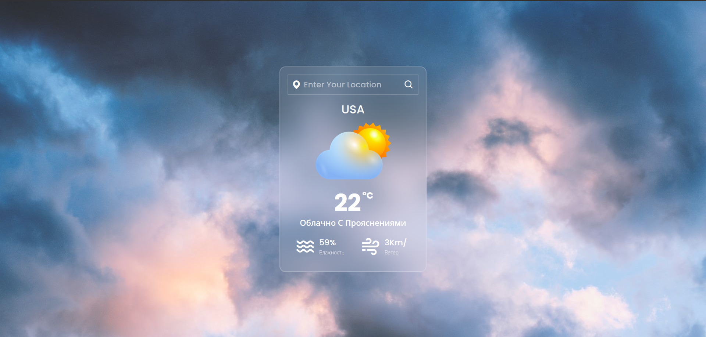

# Weather

## Описание проекта

Этот проект представляет собой веб-страницу, которая позволяет пользователю узнать текущую погоду в определенном местоположении. Страница визуально отображает информацию о температуре, описании погоды, влажности и скорости ветра.
Используемые технологии

- **HTML**: Используется для создания структуры веб-страницы.
- **CSS**: Применяется для стилизации и визуального оформления страницы.
- **JavaScript**: Используется для взаимодействия с внешними данными и обновления    информации на странице.
- **Внешние библиотеки**: Проект использует библиотеки, такие как Boxicons, для использования иконок.

### Установка и запуск

Склонируйте репозиторий на свой компьютер:

  

    git clone https://github.com/your/repository.git

Откройте файл index.html в вашем веб-браузере:

    open index.html

  Или просто дважды кликните по файлу index.html в файловом менеджере.

### Использование

   - ***Откройте веб-страницу в браузере.***
  - ***Введите местоположение в поле ввода.***
  - ***Нажмите кнопку поиска.***
  - ***На странице отобразится информация о текущей погоде в указанном местоположении.***

### Деплой

Проект доступен по следующей ссылке: https://gilded-basbousa-a1bdcd.netlify.app
